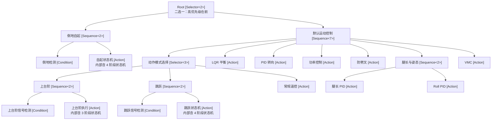
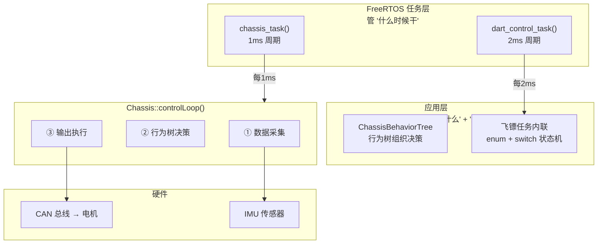

# 行为树（Behavior Tree）

行为树是一种组织机器人控制逻辑的树形决策结构。它把复杂的控制流程拆成一个个可组合、可复用的节点，用来替代层层嵌套的 `if-else` 和庞大的原始状态机。要理解它为什么值得引入，先看看不用它会写成什么样。

## 传统写法的困境

假设底盘控制逻辑是这样：倒地就自起，否则按信号执行上台阶、跳跃或常规运动。用 `if-else` 加 `switch` 会挤成一团：

```cpp
void controlLoop() {
    if (isFallen()) {
        recoveryStateMachine();          // 自起，可能跨多个周期
    } else {
        if (stairSignal())      stairClimbing();
        else if (jumpSignal())  jumpStateMachine();
        else                    remoteTargetSetting();
        balanceLQR(); turnControl(); powerControl();
        antiSplitCompensation(); legLengthControl();
        rollControl(); legVMC();
    }
}
```

这段代码有几个绕不开的毛病。所有逻辑平铺在一个函数里，加个新功能就得改动核心流程；自起、跳跃这类跨周期的状态机，进度只能靠额外的 `static` 或成员变量追踪；倒地检测必须排在最前，但代码本身并不强制这一点，改动顺序就可能引入 bug；想把"倒地检测到自起"这套逻辑搬到别的机器人上，也只能复制粘贴。归根到底，是流程的优先级和依赖关系没有被结构表达出来，全靠人脑记着。

行为树的做法是把这些逻辑组织成一棵树，每个节点只做一件事，而树的形状本身就表达了优先级和依赖。同样的逻辑画成树是这样：

```
Root [Selector: 二选一]
├── 倒地自起 [Sequence: 两个都成功才成功]
│   ├── 倒地检测 [Condition]
│   └── 自起状态机 [Action]
└── 默认运动控制 [Sequence: 全部依次执行]
    ├── 动作模式选择 [Selector: 三选一]
    │   ├── 上台阶 [Sequence]（信号检测 + 执行）
    │   ├── 跳跃 [Sequence]（信号检测 + 状态机）
    │   └── 常规遥控目标设定 [Action]
    ├── 平衡控制 LQR [Action]
    ├── 转向控制 PID [Action]
    ├── 功率控制 [Action]
    ├── 防劈叉补偿 PID [Action]
    ├── 腿长与姿态控制 [Sequence]（腿长 PID + Roll PID）
    └── 腿部控制 VMC [Action]
```

从这张图能一眼读出：倒地自起优先级最高，因为它排在根 Selector 的第一个；默认运动控制里的 7 个动作是串行依赖的；上台阶、跳跃、常规遥控三者互斥择一。结构即文档，这正是行为树相比平铺代码的核心优势。

## 与状态机、FreeRTOS 的分工

行为树、状态机、FreeRTOS 三者有相似之处，但并不冲突，它们处在不同层次。拿餐厅厨房打个比方：FreeRTOS 像排班表，只管什么时候开工，不管做什么菜；行为树像菜谱目录，管的是"客人点了牛排，先煎还是先烤，没牛排了换鸡排"这类决策和分支；状态机则像一道菜的具体做法，"煎牛排：热锅、下油、两面各煎两分钟、出锅"，管的是一个动作分几步完成。

落到代码里，三者各管一段。FreeRTOS 负责定时调度，`chassis_task()` 里的 `vTaskDelayUntil` 每 1ms 唤醒一次任务。行为树负责决策流程，根 Selector 发现倒地就走自起分支，否则走运动控制分支。状态机负责步骤推进，自起 Action 内部的 `switch(m_recoveryPhase)` 把自起拆成翻倒、预备、起立、完成几步。三条线协同起来是这样一条路径：

```
FreeRTOS 每 1ms 叫醒底盘任务
  └── chassis.controlLoop()
        ├── 读传感器（IMU、CAN）
        ├── m_behaviorTree->tick()        ← 行为树做决策
        │     └── Selector 发现倒地 → 执行"倒地自起"分支
        │           └── recoveryStateMachineCallback()  ← Action 内部状态机
        │                 └── switch(m_recoveryPhase) 逐步骤推进
        └── 输出扭矩到电机（CAN）
```

一句话概括：FreeRTOS 管"什么时候干活"，行为树管"干什么活"，状态机管"这个活分几步干"。

## 三状态协议

行为树的一切都建立在一个约定上：每个节点的 `tick()` 必须返回三种状态之一。

```cpp
enum class BTStatus : uint8_t {
    BT_SUCCESS, // 成功
    BT_FAILURE, // 失败
    BT_RUNNING  // 运行中，还没做完，下个周期继续
};
```

`BT_SUCCESS` 表示本周期任务已完成，比如条件满足或某个 PID 一步算完；`BT_FAILURE` 表示失败或条件不成立，比如倒地检测没触发。真正让行为树区别于普通函数调用的是 `BT_RUNNING`，它表示"我还没干完，下周期接着来"。有了它，跨周期的长流程才能自然地挂在树里：自起进行到翻转阶段、跳跃还在蓄力，进度就保存在节点内部的 `m_runningIndex` 和状态机的 `m_recoveryPhase` 里，不再需要一堆全局变量去追踪。

## 叶子节点：Condition 与 Action

叶子节点是树的末端，不含子节点，是真正干活的地方，分为条件和行为两类。

条件节点 `BTCondition` 检查一个布尔条件，只返回 `SUCCESS`（满足）或 `FAILURE`（不满足），绝不返回 `RUNNING`：

```cpp
class BTCondition : public BTNode {
    using ConditionFunc = bool (*)(void *context);
    ConditionFunc m_condition;
    void *m_context;
public:
    BTCondition(ConditionFunc condition, void *context = nullptr);
    BTStatus tick() override {
        if (m_condition && m_condition(m_context))
            return BTStatus::BT_SUCCESS;
        return BTStatus::BT_FAILURE;
    }
};
```

用它需要两样东西：一个返回 `bool` 的判断函数，和一个想传给它的对象。构造时把对象（通常是 `this`）作为 `context` 传入，回调里再用 `static_cast` 还原：

```cpp
static bool fallDetectionCallback(void *context) {
    auto *self = static_cast<ChassisBehaviorTree *>(context);
    auto *chassis = self->m_chassis;
    if (chassis->m_wasSafeMode) {            // 上电/安全模式恢复时强制自起
        chassis->m_wasSafeMode = false;
        self->m_recoveryPhase = RECOVERY_INIT;
        return true;
    }
    return (chassis->m_eulerAngle.x < -PI / 4);  // 前倾超 45° 算倒地
}
BTCondition m_fallDetection(fallDetectionCallback, this);
```

行为节点 `BTAction` 做一件具体的事，可以返回三种状态中的任意一种：

```cpp
class BTAction : public BTNode {
    using ActionFunc = BTStatus (*)(void *context);
    ActionFunc m_action;
    void *m_context;
public:
    BTAction(ActionFunc action, void *context = nullptr);
    BTStatus tick() override {
        if (m_action) return m_action(m_context);
        return BTStatus::BT_FAILURE;
    }
};
```

Action 能返回 `BT_RUNNING`，这就是在 Action 内部嵌入状态机的方式。自起回调用 `switch` 管理阶段，没转完就返回 `RUNNING` 让下周期继续，阶段全部走完才返回 `SUCCESS`：

```cpp
static BTStatus recoveryStateMachineCallback(void *context) {
    auto *self = static_cast<ChassisBehaviorTree *>(context);
    switch (self->m_recoveryPhase) {
    case RECOVERY_PHASE1_FLIP:
        if (fabs(self->m_targetPhi0Left) < PI)
            return BTStatus::BT_RUNNING;      // 还没转完，下周期继续
        self->m_recoveryPhase = RECOVERY_PHASE2_POSITION;
        return BTStatus::BT_RUNNING;          // 切阶段，下周期进入新阶段
    case RECOVERY_PHASE2_STANDUP:
        if (fabs(chassis->phi0 - PI / 2) > 0.05f)
            return BTStatus::BT_RUNNING;
        self->m_recoveryPhase = RECOVERY_INIT;
        return BTStatus::BT_SUCCESS;          // 自起完成
    }
}
```

行为树在这里负责调度"什么时候该自起"，状态机负责"自起分几步"，各管一段。`void *context` 的写法看着别扭，作用只是把外部对象的指针塞进回调，让同一个回调函数能服务不同对象。

## 组合节点：Sequence 与 Selector

有了叶子，还要把它们拼起来，这就是组合节点的活。组合节点本身不干活，只决定子节点怎么协作。它们都继承自 `BTComposite`，子节点存在一个栈上的定长数组里，数组大小由模板参数 `MaxChildren` 决定，不依赖 `std::vector`，避免堆分配：

```cpp
template <uint8_t MaxChildren = 16>
class BTComposite : public BTNode {
protected:
    BTNode *m_children[MaxChildren];
    uint8_t m_childCount = 0;
public:
    bool addChild(BTNode *child) {
        if (!child || m_childCount >= MaxChildren) return false;
        m_children[m_childCount++] = child;
        return true;
    }
};
```

Sequence 像一条串联电路，从左到右依次执行子节点，语义是"而且"——所有子节点都成功它才成功。执行中它遵循三条规则：全部子节点返回 `SUCCESS`，则 Sequence 返回 `SUCCESS`；任一子节点返回 `FAILURE`，立即停止并返回 `FAILURE`，后面的不再执行；任一子节点返回 `RUNNING`，则暂停并用 `m_runningIndex` 记住做到第几个，返回 `RUNNING`，下周期从这儿接着来。

```cpp
template <uint8_t MaxChildren>
class BTSequence : public BTComposite<MaxChildren> {
    uint8_t m_runningIndex = 0;
public:
    BTStatus tick() override {
        for (uint8_t i = m_runningIndex; i < this->m_childCount; i++) {
            BTStatus status = this->m_children[i]->tick();
            if (status == BTStatus::BT_FAILURE) { m_runningIndex = 0; return BTStatus::BT_FAILURE; }
            if (status == BTStatus::BT_RUNNING) { m_runningIndex = i; return BTStatus::BT_RUNNING; }
        }
        m_runningIndex = 0;
        return BTStatus::BT_SUCCESS;
    }
};
```

底盘的 7 步运动控制就是一个 `BTSequence<7>`，缺一不可，按 `addChild` 顺序依次执行。

Selector 像一条并联电路，从左到右依次尝试子节点，语义是"或者"——谁先成功就用谁。它的三条规则和 Sequence 恰好相反：任一子节点返回 `SUCCESS`，立即停止并返回 `SUCCESS`，后面的不再尝试；全部返回 `FAILURE`，则 Selector 返回 `FAILURE`；任一返回 `RUNNING`，则暂停记住位置并返回 `RUNNING`。子节点的添加顺序就是优先级，序号越小越优先：

```cpp
BTSelector<3> m_actionModeSelector;
m_actionModeSelector.addChild(&m_stairClimbing);       // 优先级 1：上台阶
m_actionModeSelector.addChild(&m_jumpControl);         // 优先级 2：跳跃
m_actionModeSelector.addChild(&m_remoteTargetSetting); // 优先级 3：兜底遥控
```

两者放在一起对比，差别一目了然：

| 组合节点 | 语义 | 何时返回 SUCCESS | 何时返回 FAILURE |
|----------|------|------------------|------------------|
| Sequence | 而且 | 全部子节点成功 | 任一子节点失败（立即中断） |
| Selector | 或者 | 任一子节点成功（立即停止） | 全部子节点失败 |

绝大多数树分支都是这两者的标准搭配：外层 Selector 决策选哪个模式，每个模式是一个 `Sequence(Condition, Action)`，条件满足才执行，最后配一个兜底 Action。

## 修饰节点

修饰节点只有一个子节点，不改变它做什么，只修改它的返回值，就像给墙刷层漆。库里有四种：`BTInverter` 把结果翻转，`Success` 变 `Failure`、`Failure` 变 `Success`、`Running` 不变，常用来把"检测到敌人"取反成"没有敌人"；`BTRepeat` 让子节点每次 `Success` 后重来，重复 N 次才返回 `Success`，N 为 0 表示无限循环；`BTForceSuccess` 不管子节点结果一律对外报成功，适合包住某个即使失败也不该中断整体流程的非关键步骤；`BTForceFailure` 强制失败，调试时临时禁用一个分支很方便。

```cpp
BTCondition enemyDetected(isEnemyVisible, &context);
BTInverter  noEnemy(&enemyDetected);  // 把"有敌人"取反成"没敌人"
```

## 树的管理器

整棵树由 `BehaviorTree` 管理，它只持有根节点，`tick()` 把调用委托给根节点后递归传导下去：

```cpp
class BehaviorTree {
    BTNode *m_root;
public:
    BehaviorTree(BTNode *root = nullptr);
    void setRoot(BTNode *root);
    BTStatus tick() { return m_root ? m_root->tick() : BTStatus::BT_FAILURE; }
    void reset();
};
```

## 底盘行为树的完整组装

前面的零件凑齐后，来看它们组装成的底盘行为树全貌：



组装代码分几波进行：先把每个"条件 + 执行"拼成小 Sequence，再拼动作模式选择器，然后串起 7 步运动控制，最后接上根节点：

```cpp
void ChassisBehaviorTree::init(Chassis *chassis) {
    m_chassis = chassis;   // 叶子节点已在构造函数中创建，此处直接引用

    // 条件 + 执行的小组合
    m_groundRecovery.addChild(&m_fallDetection);
    m_groundRecovery.addChild(&m_recoveryStateMachine);
    m_stairClimbing.addChild(&m_stairClimbingCondition);
    m_stairClimbing.addChild(&m_stairClimbingAction);
    m_jumpControl.addChild(&m_jumpCondition);
    m_jumpControl.addChild(&m_jumpStateMachine);
    m_legLengthAndPosture.addChild(&m_legLengthControl);
    m_legLengthAndPosture.addChild(&m_rollControl);

    // 动作模式选择器（顺序即优先级）
    m_actionModeSelector.addChild(&m_stairClimbing);
    m_actionModeSelector.addChild(&m_jumpControl);
    m_actionModeSelector.addChild(&m_remoteTargetSetting);

    // 7 步运动控制
    m_defaultMotionControl.addChild(&m_actionModeSelector);
    m_defaultMotionControl.addChild(&m_balanceLQR);
    m_defaultMotionControl.addChild(&m_turnControl);
    m_defaultMotionControl.addChild(&m_powerControl);
    m_defaultMotionControl.addChild(&m_antiSplitCompensation);
    m_defaultMotionControl.addChild(&m_legLengthAndPosture);
    m_defaultMotionControl.addChild(&m_legVMC);

    // 根节点
    m_root.addChild(&m_groundRecovery);
    m_root.addChild(&m_defaultMotionControl);

    chassis->registerBehaviorTree(this);
}
```

整棵树的成员由 3 个条件节点、10 个行为节点、7 个组合节点和 1 个管理器构成。行为节点里，自起、上台阶、跳跃三个各自内嵌一个多阶段状态机，其余则是一步算完的控制器；组合节点里，根是 `BTSelector<2>`（自起或运动），运动控制是 `BTSequence<7>`，动作模式是 `BTSelector<3>`，其余几个 `BTSequence<2>` 各自把一对"条件+执行"或"腿长+Roll"串起来。

## 一次 tick 的全过程

机器人正常站立（没倒地、没跳跃或上台阶信号）时，一次 `tick()` 会这样走一遍：根 Selector 先试倒地自起分支，倒地检测返回 `FAILURE`，该 Sequence 随之失败；于是转向默认运动控制 Sequence，动作模式选择器里上台阶和跳跃都 `FAILURE`，落到兜底遥控 `SUCCESS`，随后平衡、转向、功率、防劈叉、腿长姿态、VMC 逐个 `SUCCESS`，整棵树顺利跑完一帧。

```
m_tree.tick()
  └── m_root.tick()  [Selector<2>]
        ├── m_groundRecovery.tick()  [Sequence<2>]
        │     ├── m_fallDetection.tick()  → BT_FAILURE（没倒地）
        │     └── return BT_FAILURE       — Sequence 遇 Fail 终止
        └── m_defaultMotionControl.tick()  [Sequence<7>]
              ├── m_actionModeSelector.tick()  [Selector<3>]
              │     ├── m_stairClimbing  → BT_FAILURE
              │     ├── m_jumpControl    → BT_FAILURE
              │     └── m_remoteTargetSetting → BT_SUCCESS ✓
              ├── m_balanceLQR          → BT_SUCCESS ✓
              ├── m_turnControl         → BT_SUCCESS ✓
              ├── m_powerControl        → BT_SUCCESS ✓
              ├── m_antiSplitCompensation → BT_SUCCESS ✓
              ├── m_legLengthAndPosture → BT_SUCCESS ✓（腿长 + Roll）
              └── m_legVMC              → BT_SUCCESS ✓
```

## 由 FreeRTOS 驱动

行为树不会自己运转，得靠 FreeRTOS 任务定时驱动。底盘任务初始化时组装好树，之后每 1ms 调一次 `controlLoop`；`controlLoop` 里先采集传感器数据，安全检查通过后调 `m_behaviorTree->tick()` 递归执行整棵树，最后把扭矩经 CAN 输出到电机：

```cpp
// Task/src/tsk_chassis.cpp
extern "C" void chassis_task(void *argument) {
    TickType_t taskLastWakeTime = xTaskGetTickCount();
    chassis.init();
    chassisBehaviorTree.init(&chassis);
    while (1) {
        chassis.controlLoop();                       // 每 1ms 执行一次
        vTaskDelayUntil(&taskLastWakeTime, pdMS_TO_TICKS(1));
    }
}

// Chariot/src/crt_chassis.cpp
void Chassis::controlLoop() {
    transformDataToModel();               // 1. 数据采集
    forwardKinematics(m_leftLeg);
    forwardKinematics(m_rightLeg);
    if (isSafeMode) {                     // 2. 安全检查 + 行为树决策
        clearAllTorque();
    } else if (m_behaviorTree) {
        setJointMotorEnabled(true);
        m_behaviorTree->tick();           // 从这里递归执行整棵树
    }
    saturateMotorTorque();                // 3. 输出执行
    motorGiveTorque();
}
```

## 行为树与传统状态机的取舍

不是所有场景都该上行为树。GSRL 里飞镖就没用，它直接在 FreeRTOS 任务里写 `enum + switch`，流程是线性的：校准、预装、装填、射击、后处理：

```cpp
// Task/src/tsk_test.cpp
enum ControlState : uint8_t {
    POWER_ON_CALIBRATION, PRE_LOAD, LOAD, READY_SHOOT,
    AFTER_SHOOT, EMERGENCY_STOP, MANUAL_CONTROL
};
extern "C" void dart_control_task(void *argument) {
    ControlState controlState = POWER_ON_CALIBRATION;
    TickType_t lastWakeTime = xTaskGetTickCount();
    while (1) {
        updateMotorCanData();
        dr16.decodeRxData();
        switch (controlState) {
        case POWER_ON_CALIBRATION: /* 归零校准 */ break;
        case PRE_LOAD:  /* 预装填 */ break;
        case LOAD:      /* 装填，内部嵌套 switch 管子步骤 */ break;
        case READY_SHOOT: /* 射击 */ break;
        case AFTER_SHOOT: /* 后处理 */ break;
        }
        txMotorCanData();
        vTaskDelayUntil(&lastWakeTime, pdMS_TO_TICKS(2));
    }
}
```

两者没有绝对优劣，区别在适用场景。轮腿底盘用行为树，是因为它逻辑复杂、有明确优先级（倒地自起大于上台阶大于跳跃大于遥控），且每个动作内部还嵌套子状态机——Selector 天然表达优先级，Sequence 天然表达串行依赖，树结构本身就是文档，新人看图就懂，代价是要先理解三态协议和组合节点的语义。飞镖用状态机则刚好，流程线性、分支少、状态不多，一个 `enum + switch` 写在任务里，有 C 基础的都能看懂改动。判断标准很朴素：主要状态少于 5 个、流程基本线性，用 `enum + switch` 就够；分支多、有优先级、需要可复用的子模块，才值得上行为树。将来飞镖若要同时处理遥控、自动瞄准、前哨站检测等并行分支，那时再考虑迁移。

放到 GSRL 的整个系统里看，这几层的分工是清楚的：



## 写一棵自己的行为树

上手分三步。第一步写回调，条件回调返回 `bool`，动作回调返回 `BTStatus`，没做完就返回 `BT_RUNNING` 实现跨周期：

```cpp
static bool myConditionCallback(void *context) {
    auto *self = static_cast<MyBehaviorTree *>(context);
    return self->m_someSensorData > THRESHOLD;
}
static BTStatus myActionCallback(void *context) {
    auto *self = static_cast<MyBehaviorTree *>(context);
    if (/* 没做完 */) return BTStatus::BT_RUNNING;
    return BTStatus::BT_SUCCESS;
}
```

第二步声明节点并组装。叶子节点构造时绑定回调和 `context`，组合节点的模板参数是最多几个子节点：

```cpp
class MyBehaviorTree {
    BTCondition m_myCondition{myConditionCallback, this};
    BTAction    m_myAction{myActionCallback, this};
    BTSequence<2> m_mySequence;
    BTSelector<3> m_root;
    BehaviorTree  m_tree;
public:
    void init() {
        m_mySequence.addChild(&m_myCondition);
        m_mySequence.addChild(&m_myAction);
        m_root.addChild(&m_mySequence);
        m_tree.setRoot(&m_root);
    }
    BTStatus tick() { return m_tree.tick(); }
};
```

第三步在 FreeRTOS 任务里驱动，每个周期调一次 `tick()`：

```cpp
MyBehaviorTree myBT;
extern "C" void my_task(void *argument) {
    TickType_t lastWakeTime = xTaskGetTickCount();
    myBT.init();
    while (1) {
        myBT.tick();
        vTaskDelayUntil(&lastWakeTime, pdMS_TO_TICKS(1));
    }
}
```

关于参数：子节点上限由组合节点的模板参数决定，如 `BTSequence<7>`，不单独指定时用 `alg_behavior_tree.hpp` 里的默认值 `BT_DEFAULT_MAX_CHILDREN`（16）。任务周期由 `vTaskDelayUntil` 第二个参数控制，底盘 1ms、飞镖 2ms。回调里的各种阈值则在对应 `.cpp` 里用 `#define` 定义。

调试时几类常见问题有固定的排查方向。树不进预期分支，多半是 Condition 返回值不对，在回调里 `printf` 打出传感器值即可定位。Sequence 中途停掉，说明某个子节点返回了 `FAILURE`，查它的回调逻辑，想临时跳过就用 `BTForceSuccess` 包一层。`BT_RUNNING` 没生效、Action 每次被重置，通常是组合节点的 `m_runningIndex` 没正确追踪，或者 `reset()` 里把内部状态清掉了。Selector 总走第一个子节点，是因为它一直返回 `SUCCESS`，检查是不是条件太宽松。

## 源码文件索引

| 文件 | 说明 |
|------|------|
| `GSRL/Algorithm/inc/alg_behavior_tree.hpp` | 所有节点类定义 |
| `GSRL/Algorithm/src/alg_behavior_tree.cpp` | 修饰节点、叶子节点、BehaviorTree 实现 |
| `26UC-chassis/Chariot/inc/crt_chassis_behavior.hpp` | 底盘行为树声明 + 状态机枚举 + 树结构注释 |
| `26UC-chassis/Chariot/src/crt_chassis_behavior.cpp` | 全部回调实现 + `init()` 树组装 |
| `26UC-chassis/Task/src/tsk_chassis.cpp` | FreeRTOS 1ms 驱动 `controlLoop()` |
| `2026_dart/Task/src/tsk_test.cpp` | 飞镖传统状态机（对比参考） |

## 使用原则

行为树的用法可以归结为几条互斥的判断。多个行为按优先级择一，用 Selector，`addChild` 顺序即优先级；有先后依赖、前一步做完才能做下一步，用 Sequence，前一步失败则整体失败、`RUNNING` 则暂停等待；条件加执行的标准配方是 `Sequence(Condition, Action)`；跨周期的长流程让 Action 返回 `BT_RUNNING`，内部用自己的状态机管步骤；要修改已有节点的返回值而不动它的代码，用修饰节点包一层；同一回调想服务多个对象，靠 `void *context` 注入不同指针区分。而当流程简单、状态少于 5 个时，直接用 `enum + switch` 状态机反而更直观，不必强上行为树。

归根到底，行为树就是把控制逻辑组织成一棵带优先级的树，用来替代平铺的 `if-else` 和巨型 `switch`。掌握三种状态和两种组合节点，就能看懂并写出树上的大部分逻辑；修饰节点负责在不改子节点的前提下调整返回值；叶子节点通过函数指针加 `void *context` 注入业务逻辑，Action 靠返回 `RUNNING` 实现跨周期，内部常再嵌一个传统状态机管步骤。而 FreeRTOS 管调度、行为树管决策、状态机管执行细节，三层各司其职，互不冲突。

> **作者**: [Qing](https://github.com/ZhangChuqing) | **修改日期**: 2026-07-26
