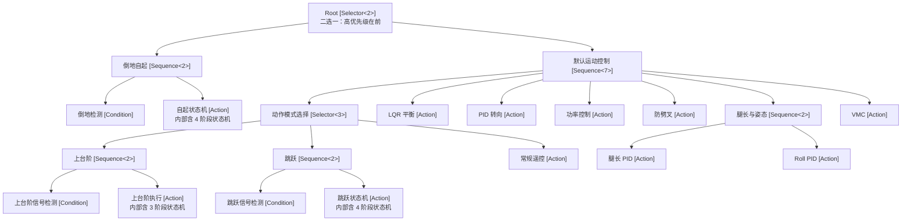
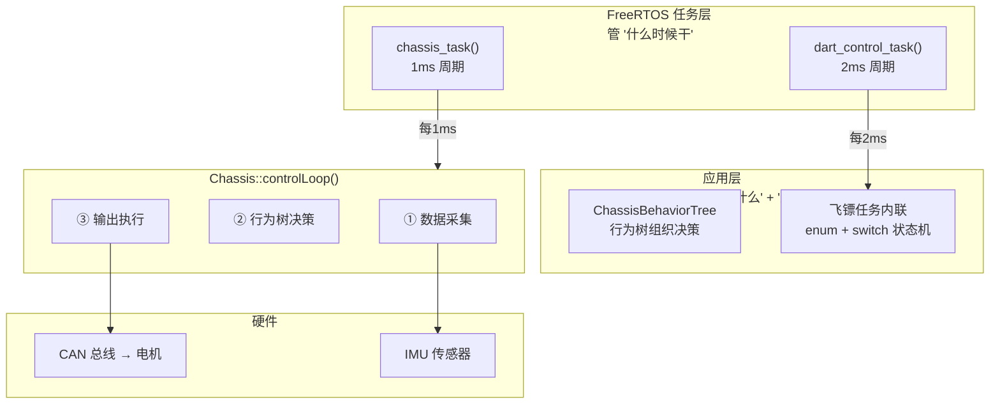

# 行为树（Behavior Tree）

行为树是一种用于组织机器人控制逻辑的树形决策结构，将复杂的控制流程拆解为可组合、可复用的节点，替代传统的 `if-else` 嵌套或原始状态机写法。

---

## 1. 概念——为什么需要行为树？

### 1.1 传统写法的问题

假设你要写一段底盘控制逻辑：如果倒地就自起，否则根据信号执行上台阶/跳跃/常规运动。用传统的 `if-else` + `switch` 会写成：

```cpp
void controlLoop() {
    if (isFallen()) {
        recoveryStateMachine();  // 自起状态机，可能跨多个周期
    } else {
        if (stairSignal()) {
            stairClimbing();
        } else if (jumpSignal()) {
            jumpStateMachine();
        } else {
            remoteTargetSetting();
        }
        balanceLQR();
        turnControl();
        powerControl();
        antiSplitCompensation();
        legLengthControl();
        rollControl();
        legVMC();
    }
}
```

这段代码的问题很明显。 
- **逻辑扁平化**——所有逻辑挤在一个函数里，加一个新功能就得改核心流程。
- **多周期状态散落**——自起和跳跃这些跨周期的状态机，不得不用额外的 `static` 变量或成员变量来追踪进度。
- **优先级不直观**——你知道倒地检测必须放最前面，但代码没有强制这一点，删一行或者调个顺序就可能出 bug。
- **复用困难**——想把这套"倒地检测 → 自起"逻辑搬到另一台机器人上？只能手动复制粘贴。

### 1.2 行为树的解决思路

行为树把控制逻辑组织成一棵树，**每个节点只做一件事**，树的形状本身就表达了优先级和依赖关系。同样的逻辑用行为树表达：

```
Root [Selector: 二选一]
├── 倒地自起 [Sequence: 两个都成功才成功]
│   ├── 倒地检测 [Condition]
│   └── 自起状态机 [Action]
│
└── 默认运动控制 [Sequence: 全部依次执行]
    ├── 动作模式选择 [Selector: 三选一]
    │   ├── 上台阶 [Sequence]
    │   │   ├── 上台阶信号检测 [Condition]
    │   │   └── 上台阶执行 [Action]
    │   ├── 跳跃 [Sequence]
    │   │   ├── 跳跃信号检测 [Condition]
    │   │   └── 跳跃状态机 [Action]
    │   └── 常规遥控目标设定 [Action]
    ├── 平衡控制 LQR [Action]
    ├── 转向控制 PID [Action]
    ├── 功率控制 [Action]
    ├── 防劈叉补偿 PID [Action]
    ├── 腿长与姿态控制 [Sequence]
    │   ├── 腿长控制 PID [Action]
    │   └── Roll 控制 PID [Action]
    └── 腿部控制 VMC [Action]
```

**树的结构本身就是文档**——你一眼就能看出：
- 倒地自起优先级最高（放在 Selector 的第一个子节点）
- 默认运动控制的 7 个 Action 是串行依赖的
- 上台阶、跳跃、常规遥控是三选一的关系

---

## 2. 行为树、状态机、FreeRTOS 是什么关系

三者有一定的相似性，但**完全不冲突。它们是不同层次的东西。**

用一个生活化类比来理解：

```
想象你是餐厅厨师长：

FreeRTOS  = 厨房的排班表 —— "每 10 分钟做一道菜"
           它只管什么时候干活，不管具体做什么。

行为树   = 菜谱的目录 —— "客人点了牛排 → 先煎还是先烤？如果没牛排了 → 换鸡排"
           它管的是决策优先级和流程分支。

状态机   = 单道菜的做法 —— "煎牛排：热锅 → 下油 → 两面各煎 2 分钟 → 出锅"
           它管的是某个具体动作分几步完成。
```

落实到代码里，三者各管一部分。

**FreeRTOS** 负责定时调度——`chassis_task()` 里的 `vTaskDelayUntil` 每 1ms 把人叫醒一次。

**行为树** 负责决策流程——`m_root` 这个 Selector 发现倒地就走自起分支，没倒地就走运动控制分支。

**状态机** 负责步骤推进——自起 Action 回调内部的 `switch(m_recoveryPhase)` 把自起拆成 4 步：翻倒 → 预备 → 起立 → 完成。

三条线协同工作的完整路径是：

```
FreeRTOS 每 1ms 叫醒底盘任务
    └── chassis.controlLoop()
          ├── 读传感器（IMU、CAN）
          ├── m_behaviorTree->tick()   ← 行为树做决策
          │     └── Selector 发现倒地 → 执行"倒地自起"分支
          │           └── recoveryStateMachineCallback()  ← Action 内部的状态机
          │                 └── switch(m_recoveryPhase):  ← 逐步骤推进
          │                       case FLIP:    旋转腿部 → BT_RUNNING
          │                       case STANDUP: 起立完成 → BT_SUCCESS
          └── 输出扭矩到电机（CAN）
```

> FreeRTOS 管"什么时候干活"，行为树管"干什么活"，状态机管"这个活分几步干"。它们各司其职，互不冲突。

---

## 3. 三状态协议——一切节点的基础

行为树中每个节点的 `tick()` 方法必须返回三种状态之一：

```cpp
enum class BTStatus : uint8_t {
    BT_SUCCESS, // 成功
    BT_FAILURE, // 失败
    BT_RUNNING  // 运行中（还没做完，下个周期继续）
};
```

`BT_SUCCESS` 表示本周期任务已经做完——比如条件满足，或者某个 PID 控制一步到位。`BT_FAILURE` 表示任务失败或条件不成立——比如倒地检测没触发、PID 计算出错。**`BT_RUNNING` 是三种状态中最关键的一个**——它表示"我还没干完，下个周期接着来"，比如自起还在 Phase1 翻转、跳跃还在蹲下蓄力。

为什么 `BT_RUNNING` 如此重要？因为它让跨周期的长流程可以自然地嵌在树中——进度被保存在节点内部的 `m_runningIndex` 和状态机的 `m_recoveryPhase` 里，不再需要额外的全局变量来追踪。

---

## 4. 从叶子开始——BTAction 与 BTCondition

先别急着看整棵树。我们从最简单的"一片叶子"开始理解——叶子节点是行为树的末端，不包含子节点，是整个树真正"干活"的地方。

### 4.1 BTCondition（条件节点）

条件节点检查**一个布尔条件**。它只返回 `SUCCESS`（条件满足）或 `FAILURE`（不满足），**绝不返回 `RUNNING`**。

```cpp
class BTCondition : public BTNode {
public:
    using ConditionFunc = bool (*)(void *context);
private:
    ConditionFunc m_condition; // 你写的判断函数
    void *m_context;           // 你想传进去的任何数据
public:
    BTCondition(ConditionFunc condition, void *context = nullptr);
    BTStatus tick() override {
        if (m_condition != nullptr && m_condition(m_context))
            return BTStatus::BT_SUCCESS;
        return BTStatus::BT_FAILURE;
    }
};
```

**怎么用**——需要两样东西：一个判断函数 + 你要传的对象。

```cpp
// 1. 写一个判断函数（返回 bool）
static bool fallDetectionCallback(void *context) {
    auto *self = static_cast<ChassisBehaviorTree *>(context);
    auto *chassis = self->m_chassis;
    // 上电/安全模式恢复时强制触发自起
    if (chassis->m_wasSafeMode) {
        chassis->m_wasSafeMode = false;
        self->m_recoveryPhase = RECOVERY_INIT;
        return true;
    }
    return (chassis->m_eulerAngle.x < -PI / 4); // 车体前倾超过 45° 算倒地
}

// 2. 创建条件节点，把 this 传进去
BTCondition m_fallDetection(fallDetectionCallback, this);
```

### 4.2 BTAction（行为节点）

行为节点做**一件具体的事**，可以返回三种状态中的任意一种。

```cpp
class BTAction : public BTNode {
public:
    using ActionFunc = BTStatus (*)(void *context);
private:
    ActionFunc m_action;
    void *m_context;
public:
    BTAction(ActionFunc action, void *context = nullptr);
    BTStatus tick() override {
        if (m_action != nullptr) return m_action(m_context);
        return BTStatus::BT_FAILURE;
    }
};
```

Action 可以返回 `BT_RUNNING` 来告诉行为树"我还没做完，下个周期继续做我这件事"。这就是 **在 Action 内部嵌入状态机** 的方式：

```cpp
static BTStatus recoveryStateMachineCallback(void *context) {
    auto *self = static_cast<ChassisBehaviorTree *>(context);
    switch (self->m_recoveryPhase) {
    case RECOVERY_PHASE1_FLIP:
        // 持续旋转腿部翻转机体
        if (fabs(self->m_targetPhi0Left) < PI)
            return BTStatus::BT_RUNNING;   // 还没转完 → 下周期继续
        self->m_recoveryPhase = RECOVERY_PHASE2_POSITION;
        return BTStatus::BT_RUNNING;       // 阶段切换 → 下周期进入新阶段

    case RECOVERY_PHASE2_STANDUP:
        if (fabs(chassis->phi0 - PI / 2) > 0.05f)
            return BTStatus::BT_RUNNING;   // 还在移动
        self->m_recoveryPhase = RECOVERY_INIT;
        return BTStatus::BT_SUCCESS;       // 自起完成！
    }
}
```

> **这里就是行为树 + 状态机共同作用的地方**：行为树负责调度"什么时候该自起"，状态机负责"自起分几步完成"——两者各司其职，互不冲突。

### 4.3 context 指针——怎么把数据传进去

`void *context` 看起来奇怪，但用法很简单：

```cpp
// 构造时传入 this
m_fallDetection(fallDetectionCallback, this);
m_recoveryStateMachine(recoveryStateMachineCallback, this);

// 回调内部用 static_cast 还原
static bool fallDetectionCallback(void *context) {
    auto *self = static_cast<ChassisBehaviorTree *>(context);
    auto *chassis = self->m_chassis;  // 现在你能访问所有成员了
    return chassis->phi0 < 0.0f;
}
```

---

## 5. 搭积木——组合节点 Sequence 与 Selector

有了叶子节点，下一步是把它们"拼"起来。组合节点就像乐高的连接件——本身不干活，但决定了子节点怎么协作。

### 5.1 基类 BTComposite

```cpp
template <uint8_t MaxChildren = 16>  // 模板参数 = 最多放几个子节点
class BTComposite : public BTNode {
protected:
    BTNode *m_children[MaxChildren];  // 子节点数组（栈上，不堆分配）
    uint8_t m_childCount = 0;
public:
    bool addChild(BTNode *child) {
        if (child == nullptr || m_childCount >= MaxChildren) return false;
        m_children[m_childCount++] = child;
        return true;
    }
};
```

> 细节：`MaxChildren` 是模板参数，数组在栈上分配，不依赖 `std::vector`，避免堆内存。

### 5.2 Sequence（顺序节点）——"接连做"

Sequence 的逻辑很像一个**串联电路**：它从左到右依次执行子节点。

**三种结束状态，拎出来看：**

1. **全部子节点返回 `SUCCESS`** → Sequence 返回 **`SUCCESS`**。
   意思是"我手下所有人都把活干完了"，整个 Sequence 宣布成功。

2. **任一子节点返回 `FAILURE`** → Sequence **立刻停止**，返回 **`FAILURE`**。
   后面的子节点不再执行。意思是"有人掉链子了，整个流程中断"。

3. **任一子节点返回 `RUNNING`** → Sequence **暂停**，记住当前做到第几个（`m_runningIndex = i`），返回 **`RUNNING`**。
   意思是"还没到终点，但我记住位置了，下个周期从这儿继续"。

用图来说：

```
Sequence: 依次执行
┌──→ Child0 ──→ Child1 ──→ Child2 ──→ SUCCESS    ← 全部成功
│      ↓Fail      ↓Fail      ↓Fail
│    FAILURE    FAILURE    FAILURE                 ← 遇失败立即终止
│      ↓Running   ↓Running   ↓Running
│    RUNNING    RUNNING    RUNNING                 ← 遇 Running 暂停，记住位置
```

核心源码：

```cpp
template <uint8_t MaxChildren>
class BTSequence : public BTComposite<MaxChildren> {
private:
    uint8_t m_runningIndex = 0; // 记住"上次做到哪儿了"
public:
    BTStatus tick() override {
        for (uint8_t i = m_runningIndex; i < this->m_childCount; i++) {
            BTStatus status = this->m_children[i]->tick();
            if (status == BTStatus::BT_FAILURE) { m_runningIndex = 0; return BTStatus::BT_FAILURE; }
            if (status == BTStatus::BT_RUNNING) { m_runningIndex = i; return BTStatus::BT_RUNNING; }
        }
        m_runningIndex = 0;
        return BTStatus::BT_SUCCESS;
    }
};
```

底盘中的例子——7 步控制，缺一不可：

```cpp
BTSequence<7> m_defaultMotionControl;
m_defaultMotionControl.addChild(&m_actionModeSelector);   // 1. 先决定做什么动作
m_defaultMotionControl.addChild(&m_balanceLQR);            // 2. 再跑平衡控制
// ... 共 7 步
```

### 5.3 Selector（选择节点）——"选一个做"

Selector 的逻辑很像一个**并联电路**：从左到右依次尝试子节点，看看哪个能成。

**三种结束状态，跟 Sequence 截然不同：**

1. **任一子节点返回 `SUCCESS`** → Selector **立刻停止**，返回 **`SUCCESS`**。
   后面的子节点不再尝试。意思是"找到一个能干的就行了，后面的不管了"。

2. **全部子节点都返回 `FAILURE`** → Selector 返回 **`FAILURE`**。
   意思是"试了一圈没一个能用的，宣告失败"。

3. **任一子节点返回 `RUNNING`** → Selector **暂停**，记住当前尝试到第几个，返回 **`RUNNING`**。
   意思是"当前这个还在跑，我等着它，其他候选先不管"。

用图来说：

```
Selector: 依次尝试
┌──→ Child0 ──→ Child1 ──→ Child2 ──→ FAILURE    ← 全部失败
│      ↓Success   ↓Success   ↓Success
│    SUCCESS    SUCCESS    SUCCESS                 ← 遇成功立即停止
│      ↓Running   ↓Running   ↓Running
│    RUNNING    RUNNING    RUNNING                 ← 遇 Running 暂停，记住位置
```

**子节点的顺序就是优先级！** 序号越小越优先。

跟 Sequence 的**核心区别**记牢：Sequence 是"**而且**"——所有人必须成功。Selector 是"**或者**"——谁先成功用谁。

底盘中的例子：

```cpp
BTSelector<3> m_actionModeSelector;
m_actionModeSelector.addChild(&m_stairClimbing);     // 优先级 1：上台阶
m_actionModeSelector.addChild(&m_jumpControl);       // 优先级 2：跳跃
m_actionModeSelector.addChild(&m_remoteTargetSetting); // 优先级 3：兜底遥控
```

### 5.4 标准搭配模式

绝大多数树分支都遵循这个模式：

```
Selector（决策层："选哪个模式"）
├── Sequence（模式 A：条件 + 执行）
│   ├── Condition（条件满足吗？）
│   └── Action（做！）
├── Sequence（模式 B：条件 + 执行）
└── Action（兜底默认行为）
```

---

## 6. 装修——修饰节点

修饰节点只有一个子节点，不改变子节点的行为，只**修改子节点的返回值**。就像给一面墙刷漆——墙还是那面墙，但外观变了。

四种修饰节点各干各的：

- **`BTInverter`**：把子节点的结果翻转——Success 变 Failure，Failure 变 Success，Running 不变。典型用法是把"检测到敌人"取反，变成"没有敌人"这个新的条件。
- **`BTRepeat`**：子节点每次 Success 后重新来一遍，重复 N 次后自己才返回 Success（N=0 表示无限循环）。适合需要循环执行的场景。
- **`BTForceSuccess`**：不管子节点成功还是失败，一律对外宣称成功。某个非关键步骤即使挂了也别让整体流程断掉，就用它包一层。
- **`BTForceFailure`**：强制失败，调试时临时禁用一个分支很好用。

```cpp
// 示例：把"检测到敌人"变成"没有敌人"条件
BTCondition enemyDetected(isEnemyVisible, &context);
BTInverter noEnemy(&enemyDetected); // 取反
```

---

## 7. BehaviorTree——整棵树的管理器

```cpp
class BehaviorTree {
private:
    BTNode *m_root;
public:
    BehaviorTree(BTNode *root = nullptr);
    void setRoot(BTNode *root);
    BTStatus tick();   // 从根节点开始，递归执行整棵树
    void reset();      // 重置所有节点状态
};
```

`tick()` 的实现很简单——就是把调用委托给根节点，然后递归传导：

```cpp
BTStatus BehaviorTree::tick() {
    if (m_root != nullptr) return m_root->tick();
    return BTStatus::BT_FAILURE;
}
```

---

## 8. 组装起来——底盘行为树完整实例

现在你已经认识了所有零件，来看看它们组装在一起是什么样子。

### 8.1 行为树结构全景



| 结构 | 什么意思 | 
|------|---------|
| `Root [Selector<2>]` | 倒地自起优先于默认运动控制 |
| `倒地自起 [Sequence<2>]` | 必须先检测到倒地，才执行自起 |
| `动作模式 [Selector<3>]` | 上台阶 > 跳跃 > 遥控（按添加顺序排优先级） |
| `默认运动 [Sequence<7>]` | 7 步必须依次完成 |

### 8.2 代码——从零组装

```cpp
void ChassisBehaviorTree::init(Chassis *chassis) {
    m_chassis = chassis;

    // 叶子节点已经在构造函数中创建好了，直接引用

    // ===== 第 1 波：搭"条件+执行"小组合 =====
    m_groundRecovery.addChild(&m_fallDetection);
    m_groundRecovery.addChild(&m_recoveryStateMachine);

    m_stairClimbing.addChild(&m_stairClimbingCondition);
    m_stairClimbing.addChild(&m_stairClimbingAction);

    m_jumpControl.addChild(&m_jumpCondition);
    m_jumpControl.addChild(&m_jumpStateMachine);

    m_legLengthAndPosture.addChild(&m_legLengthControl);
    m_legLengthAndPosture.addChild(&m_rollControl);

    // ===== 第 2 波：拼动作模式选择器 =====
    m_actionModeSelector.addChild(&m_stairClimbing);     // 优先级 1
    m_actionModeSelector.addChild(&m_jumpControl);       // 优先级 2
    m_actionModeSelector.addChild(&m_remoteTargetSetting); // 兜底

    // ===== 第 3 波：串起 7 步运动控制 =====
    m_defaultMotionControl.addChild(&m_actionModeSelector);
    m_defaultMotionControl.addChild(&m_balanceLQR);
    m_defaultMotionControl.addChild(&m_turnControl);
    m_defaultMotionControl.addChild(&m_powerControl);
    m_defaultMotionControl.addChild(&m_antiSplitCompensation);
    m_defaultMotionControl.addChild(&m_legLengthAndPosture);
    m_defaultMotionControl.addChild(&m_legVMC);

    // ===== 第 4 波：根节点 =====
    m_root.addChild(&m_groundRecovery);
    m_root.addChild(&m_defaultMotionControl);

    // 注册到底盘
    chassis->registerBehaviorTree(this);
}
```

### 8.3 成员变量全览

| 类别 | 变量 | 类型 | 干什么的 |
|------|------|------|---------|
| **条件 (3)** | `m_fallDetection` | `BTCondition` | 检测倒地 |
| | `m_stairClimbingCondition` | `BTCondition` | 检测上台阶信号 |
| | `m_jumpCondition` | `BTCondition` | 检测跳跃信号 |
| **动作 (10)** | `m_recoveryStateMachine` | `BTAction` | 自起（4 阶段状态机） |
| | `m_stairClimbingAction` | `BTAction` | 上台阶（3 阶段状态机） |
| | `m_jumpStateMachine` | `BTAction` | 跳跃（4 阶段状态机） |
| | `m_remoteTargetSetting` | `BTAction` | 遥控目标设定 |
| | `m_balanceLQR` | `BTAction` | LQR 平衡控制 |
| | `m_turnControl` | `BTAction` | PID 转向 |
| | `m_powerControl` | `BTAction` | 功率控制 |
| | `m_antiSplitCompensation` | `BTAction` | 防劈叉补偿 |
| | `m_legLengthControl` | `BTAction` | 腿长 PID |
| | `m_rollControl` | `BTAction` | Roll PID |
| | `m_legVMC` | `BTAction` | 腿部 VMC |
| **组合 (7)** | `m_root` | `BTSelector<2>` | 根节点：自起 \| 运动 |
| | `m_groundRecovery` | `BTSequence<2>` | 倒地检测 → 自起 |
| | `m_defaultMotionControl` | `BTSequence<7>` | 7 步串行控制 |
| | `m_actionModeSelector` | `BTSelector<3>` | 台阶 \| 跳跃 \| 遥控 |
| | `m_stairClimbing` | `BTSequence<2>` | 台阶检测 → 执行 |
| | `m_jumpControl` | `BTSequence<2>` | 跳跃检测 → 执行 |
| | `m_legLengthAndPosture` | `BTSequence<2>` | 腿长 → Roll |
| **管理器 (1)** | `m_tree` | `BehaviorTree` | 树运行时管理 |

---

## 9. 运行机制——一次 tick 的全过程

假设机器人正常站立（没倒地、没跳跃/上台阶信号），一次 `tick()` 的调用过程：

```
m_tree.tick()
  └── m_root.tick()  [Selector<2>]
        ├── m_groundRecovery.tick()  [Sequence<2>]
        │     ├── m_fallDetection.tick()  → BT_FAILURE (没倒地)
        │     └── return BT_FAILURE      — Sequence 遇 Fail，终止
        │
        └── m_defaultMotionControl.tick()  [Sequence<7>]
              ├── m_actionModeSelector.tick()  [Selector<3>]
              │     ├── m_stairClimbing.tick()  → BT_FAILURE
              │     ├── m_jumpControl.tick()    → BT_FAILURE
              │     └── m_remoteTargetSetting.tick()  → BT_SUCCESS  ✓
              ├── m_balanceLQR.tick()           → BT_SUCCESS  ✓
              ├── m_turnControl.tick()          → BT_SUCCESS  ✓
              ├── m_powerControl.tick()         → BT_SUCCESS  ✓
              ├── m_antiSplitCompensation.tick()→ BT_SUCCESS  ✓
              ├── m_legLengthAndPosture.tick()
              │     ├── m_legLengthControl.tick() → BT_SUCCESS  ✓
              │     └── m_rollControl.tick()      → BT_SUCCESS  ✓
              └── m_legVMC.tick()               → BT_SUCCESS  ✓
```

---

## 10. FreeRTOS 集成——行为树如何被驱动

### 10.1 轮腿底盘：FreeRTOS → controlLoop → 行为树

```cpp
// Task/src/tsk_chassis.cpp —— FreeRTOS 任务
extern "C" void chassis_task(void *argument)
{
    TickType_t taskLastWakeTime = xTaskGetTickCount();
    chassis.init();
    chassisBehaviorTree.init(&chassis);  // 组装行为树
    while (1) {
        chassis.controlLoop();                      // ★ 每 1ms 执行一次
        vTaskDelayUntil(&taskLastWakeTime, pdMS_TO_TICKS(1));
    }
}

// Chariot/src/crt_chassis.cpp —— 控制回路
void Chassis::controlLoop()
{
    // 1. 数据采集（传感器 → 模型）
    transformDataToModel();
    forwardKinematics(m_leftLeg);
    forwardKinematics(m_rightLeg);

    // 2. 安全检查 + 行为树决策
    if (isSafeMode) {
        clearAllTorque();
    } else if (m_behaviorTree != nullptr) {
        setJointMotorEnabled(true);
        m_behaviorTree->tick();  // ★ 从这里开始递归执行整棵树
    }

    // 3. 输出执行（模型 → CAN → 电机）
    saturateMotorTorque();
    motorGiveTorque();
}
```

**调用链路图：**

```
FreeRTOS 定时器 (1ms)
  └── chassis_task()
        └── chassis.controlLoop()
              ├── 数据采集（传感器 → 模型）
              ├── m_behaviorTree->tick()  ← 行为树做决策
              └── 输出执行（模型 → CAN → 电机）
```

### 10.2 飞镖：传统状态机方式（对比参考）

飞镖目前不使用行为树，直接在 FreeRTOS 任务里用 `enum + switch-case`：

```cpp
// Task/src/tsk_test.cpp
enum ControlState : uint8_t {
    POWER_ON_CALIBRATION, PRE_LOAD, LOAD, READY_SHOOT, AFTER_SHOOT, EMERGENCY_STOP, MANUAL_CONTROL
};

extern "C" void dart_control_task(void *argument)
{
    ControlState controlState = POWER_ON_CALIBRATION;
    TickType_t lastWakeTime = xTaskGetTickCount();

    while (1) {
        updateMotorCanData();
        dr16.decodeRxData();

        switch (controlState) {
        case POWER_ON_CALIBRATION: /* ... 归零校准 */ break;
        case PRE_LOAD:            /* ... 预装填 */   break;
        case LOAD:                /* ... 装填（嵌套 switch 管理子步骤） */ break;
        case READY_SHOOT:         /* ... 射击 */     break;
        case AFTER_SHOOT:         /* ... 后处理 */   break;
        // ...
        }

        txMotorCanData();
        vTaskDelayUntil(&lastWakeTime, pdMS_TO_TICKS(2));
    }
}
```

### 10.3 两种方式对比

行为树和传统状态机没有绝对的优劣，只是适用场景不同。

轮腿底盘用了行为树：它的控制逻辑复杂，有明确的优先级关系（倒地自起 > 上台阶 > 跳跃 > 遥控），且每个动作内部又嵌套了子状态机。行为树的 Selector 天然表达优先级，Sequence 天然表达串行依赖，树结构自身就是文档——新人看一张图就能理解整个控制系统在干什么。代价是学习曲线更陡，需要先理解三态协议和组合节点的语义。

飞镖用传统状态机刚好合适：它的流程是线性的（校准 → 预装 → 装填 → 射击 → 后处理），分支简单，状态数不多。一个 `enum + switch` 直接写在一个任务里，有 C 基础的都能看懂和修改。但如果未来飞镖需要同时处理"遥控指令 + 自动瞄准 + 前哨站检测"等多个并行决策分支，那时才值得考虑迁移到行为树。

> **简单原则**：如果你有 < 5 个主要状态，流程基本是线性的，用 `enum + switch` 状态机就够。如果逻辑分支多、有优先级关系、需要可复用的子模块，用行为树。

---

## 11. 系统全景——行为树在 GSRL 中的位置

现在你对节点已有深入理解，回头看清全貌：



> FreeRTOS 管"什么时候干活"，行为树/状态机管"干什么活"——三者不冲突，而是分层协作。

---

## 12. 动手写——如何创建自己的行为树

### 12.1 三步法

**第一步：写回调函数**

```cpp
// 条件回调（返回 bool）
static bool myConditionCallback(void *context) {
    auto *self = static_cast<MyBehaviorTree *>(context);
    return self->m_someSensorData > THRESHOLD;
}

// 动作回调（返回 BTStatus）
static BTStatus myActionCallback(void *context) {
    auto *self = static_cast<MyBehaviorTree *>(context);
    if (/* 没做完 */) return BTStatus::BT_RUNNING;  // 跨周期
    return BTStatus::BT_SUCCESS;
}
```

**第二步：声明节点并组装树**

```cpp
class MyBehaviorTree {
private:
    // 叶子节点——构造时绑定回调 + context
    BTCondition m_myCondition{myConditionCallback, this};
    BTAction    m_myAction{myActionCallback, this};

    // 组合节点——模板参数 = 最多几个子节点
    BTSequence<2> m_mySequence;
    BTSelector<3> m_root;
    BehaviorTree m_tree;

public:
    void init() {
        m_mySequence.addChild(&m_myCondition);
        m_mySequence.addChild(&m_myAction);
        m_root.addChild(&m_mySequence);
        // ... 加更多分支
        m_tree.setRoot(&m_root);
    }
    BTStatus tick() { return m_tree.tick(); }
};
```

**第三步：在 FreeRTOS 任务中驱动**

```cpp
MyBehaviorTree myBT;

extern "C" void my_task(void *argument) {
    TickType_t lastWakeTime = xTaskGetTickCount();
    myBT.init();
    while (1) {
        myBT.tick();  // 每个周期执行一次
        vTaskDelayUntil(&lastWakeTime, pdMS_TO_TICKS(1));
    }
}
```

### 12.2 配置参数

子节点的最大数量由组合节点声明时的模板参数决定，比如 `BTSequence<7>` 中的 `<7>`。每个组合节点可以单独指定，不想单独指定时用默认值——`alg_behavior_tree.hpp` 里的 `BT_DEFAULT_MAX_CHILDREN`，默认是 16。

FreeRTOS 任务的调用周期在 `tsk_*.cpp` 里通过 `vTaskDelayUntil` 的第二个参数控制 —— 底盘是 `pdMS_TO_TICKS(1)`（1ms），飞镖是 `pdMS_TO_TICKS(2)`（2ms）。回调函数内部的各种阈值（PID 增益、角度阈值、计时器时长等）各自在对应的 `.cpp` 文件里用 `#define` 定义。

### 12.3 常见问题

**树不进入预期分支。** 多半是 Condition 回调的返回值不对。在回调里加一行 `printf` 把当前传感器值打出来，一眼就能看出问题。

**Sequence 中途停掉了。** 说明某个子节点返回了 `FAILURE`。检查该节点的回调逻辑，如果只是想临时跳过这个问题，用 `BTForceSuccess` 把它包一层调试。

**`BT_RUNNING` 没生效，Action 每次都被重置。** 很可能是组合节点的 `m_runningIndex` 没有正确追踪。确认 Action 的 `reset()` 是否被正确实现——如果 `reset()` 里把内部状态清掉了，`RUNNING` 自然就断了。

**Selector 总是走第一个子节点。** 因为第一个子节点一直返回 `SUCCESS`，Selector 根本不会往后尝试。检查第一个子节点的 Condition 是不是太宽松了。

---

## 13. 源码文件索引

| 文件 | 说明 |
|------|------|
| `GSRL/Algorithm/inc/alg_behavior_tree.hpp` | 所有节点类定义 |
| `GSRL/Algorithm/src/alg_behavior_tree.cpp` | 修饰节点、叶子节点、BehaviorTree 实现 |
| `26UC-chassis/Chariot/inc/crt_chassis_behavior.hpp` | 底盘行为树声明 + 状态机枚举 + 树结构注释 |
| `26UC-chassis/Chariot/src/crt_chassis_behavior.cpp` | 全部回调实现 + `init()` 树组装 |
| `26UC-chassis/Task/src/tsk_chassis.cpp` | FreeRTOS 1ms 驱动 `controlLoop()` |
| `2026_dart/Task/src/tsk_test.cpp` | 飞镖传统状态机（对比参考） |

---

## 14. 使用原则

**互斥选择用 Selector。** 多个行为按优先级排列，谁先满足条件用谁。`addChild` 的顺序就是优先级。

**串行依赖用 Sequence。** A 做完才能做 B，B 做完才能做 C。前一步失败则整体失败，前一步 RUNNING 则暂停等待。

**条件 + 执行的标准配方是 `Sequence(Condition, Action)`。** 条件不满足就跳过，条件满足才执行。

**跨周期长流程让 Action 返回 `BT_RUNNING`。** Action 内部用自己的状态机管理步骤，对外返回 `RUNNING` 告诉行为树"我还没完"。

**修改已有节点的行为用 BTDecorator 包裹。** 不侵入原节点代码，只改变它的返回结果。

**复用同一回调用 `void *context`。** 不同 context 指针注入不同对象，同一个回调函数可以服务多个场景。

**流程简单（< 5 个状态）直接用 `enum + switch` 状态机。** 比行为树更直观，别过度设计。

---

## 15. 总结

行为树本质上是把控制逻辑组织成一棵带优先级的树，替代平铺的 `if-else` 和巨型 `switch`。你只需要掌握三种状态（`SUCCESS` / `FAILURE` / `RUNNING`）和两种组合节点（Sequence 是"而且"，Selector 是"或者"），就能看懂和写出大部分树上逻辑。

修饰节点让你在不改子节点的情况下修改其返回值。叶子节点（`BTAction` 和 `BTCondition`）通过函数指针 + `void *context` 注入业务逻辑——Action 可以返回 `RUNNING` 实现跨周期，内部通常嵌套一个传统状态机来管理步骤。`BehaviorTree` 是整棵树的管理器，一次 `tick()` 从根节点递归执行到底。

最后记住三点关系：**FreeRTOS 管调度**（什么时候跑），**行为树管决策**（跑什么），**状态机管执行细节**（怎么一步步跑）——三层各司其职，互不冲突。

> **作者**: [Qing](https://github.com/ZhangChuqing) | **修改日期**: 2026-07-21
